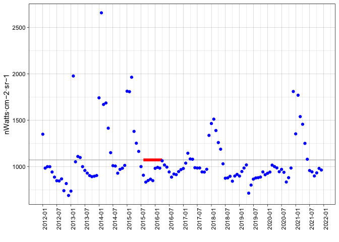

Can Night Lights Detect Flood Lights?
================

Between August 2015 and March 2016, [341
lights](https://www1.nyc.gov/site/nycha/about/press/pr-2016/polo-grounds-20160310.page)
were installed for crime mitigation at the Polo Grounds Towers, a
housing development owned by the New York City Public housing housing
authority.

For this exercise, we are going to examine whether the illumination of
those flood lights can be detected using night lights data, by looking
for differences in illumination before and after the periods of
installation.

This represents a fine-grained spatial analysis, as the location in
question represents a single pixel in the night lights dataset.

## Datasets

We will first start by loading the data we need:

-   A set of images representing the time series of monthly night lights
    data over New York City covering the period 2012-2021, as well as
    the monthly average over the period and the average of each month
    during the 10 year period.
-   The location of the Polo Grounds public housing project in NYC.
-   Data showing where NYC’s public housing projects are located
-   Census tracts for New York City

``` r
sysfiles <- function(x) {
  system.file(paste0("extdata/", x), package = "USFlite")
}
  
# NYC census tracts
nytract <- readRDS(sysfiles("nytract.RDS")) 

# NYC public housing developments
nycha <- readRDS(sysfiles("nycha.RDS")) 
nyc <- readRDS(sysfiles("nyc.rds")) 

# Polo Grounds Towers to test hypothesis - capture floodlight presence
polo <- readRDS(sysfiles("polo.RDS"))

# Nightlights data, monthly, average for each month over 20 years, 20 year 
# mean
nlights <- rast(sysfiles("nightlights.tif"))
nlight_mo <- rast(sysfiles("nightlights_mean_month.tif"))
nlights <- rast(sysfiles("nightlights.tif"))
nlight_lt <- rast(sysfiles("nightlights_mean.tif"))
names(nlight_lt) <- "brightness"
nl_dates <- readRDS(sysfiles("nightlight_dates.rds"))
```

### NYC public housing

The map below shows New York City’s public housing developments, with
the location of the Polo Grounds project shown in red.

<!-- -->

### Night lights data over NYC

Let’s now look at the nightlights data over New York. We will start just
with overall brightness. The image below is the average monthly
brightness of NYC lights between the years 2012 - and 2021.

``` r
p <- ggplot(as.data.frame(nlight_lt, xy = TRUE)) + 
  geom_raster(aes(x = x, y = y, fill = brightness)) +
  geom_sf(data = nyc, fill = "transparent", col = "yellow", size = 0.2) +
  geom_sf(data = polo, col = "blue") + 
  geom_sf(data = st_buffer(polo, dist = 2000), fill = "transparent", 
          col = "red") + 
  scale_fill_distiller(
    guide = guide_colorbar(title = "nWatts·cm−2·sr−1", ticks = FALSE),
    type = "seq", direction = -1, palette = "Greys"
  ) + xlab('') + ylab('') + theme_void()
p
```


### Brightness over the Polo Grounds public housing project

We are now going to extract the full 12 year record of monthly night
light data from the location of the Polo Grounds Towers, as well as the
averages for each month and long term monthly averages, and test whether
a change in brightness can be detected following the dates of
installation.

First we will extract and average the data. The footprint of the Polo
Ground Towers actually overlaps two pixels, so we will average across
the two pixels first.

``` r
pologcs <- st_transform(polo, 4326)
polo_lts_ts <- colMeans(extract(nlights, vect(pologcs))[-1])
polo_lts_mo <- colMeans(extract(nlight_mo, vect(pologcs))[-1])
polo_lts_mu <- colMeans(extract(nlight_lt, vect(pologcs))[-1])

lts_tbl <- tibble(date = nl_dates, lts = unname(polo_lts_ts)) %>% 
  mutate(mo = strftime(date, "%m"), yr = strftime(date, "%Y"))  # add mo/year
```

#### Changes in monthly brightness

Now we will plot and look for any pattern, starting with the time
series. The blue points represent the monthly brightness values, and the
grey line shows the long term mean brightness, while the red line shows
the time period when the floodlights were installed.

``` r
inst_dts <- as.Date(c("2015-08-01", "2016-03-31"), "%Y-%m-%d")
p <- ggplot() + 
  geom_hline(yintercept = polo_lts_mu, color = "grey") + 
  geom_linerange(aes(y = polo_lts_mu, xmin = inst_dts[1], xmax = inst_dts[2]), 
                 col = "red", size = 2) + 
  geom_point(data = lts_tbl, aes(x = date, y = lts), col = "blue") + 
  ylab("nWatts·cm−2·sr−1") + xlab("") + 
  scale_x_date(date_breaks = "6 months", date_labels = "%Y-%m") + 
  theme_linedraw() + 
  theme(axis.text.x = element_text(angle=90))
p
```

<!-- -->

Looking at the results, we don’t really see anything obvious in terms of
a difference in brightness after the period of installation. There are
some notable peaks on either side, with the highest peaks before the
installation occurred (we will discuss what might cause these peaks).

Let’s take a look another way. The time series seems to suggest that the
least bright periods of the year are in the summer, around July-August
(why might that be?). Is there a difference in the brightness levels in
the June-July-August before and after lights installation?

``` r
summers_before <- lts_tbl %>% 
  filter(yr <= 2015 & mo %in% c("06", "07", "08")) %>% 
  summarise(lts = mean(lts))
summers_after <- lts_tbl %>% 
  filter(yr >= 2016 & mo %in% c("06", "07", "08")) %>% 
  summarise(lts = mean(lts))
```

The average brightness of the three summer month before / during the
installation had an average brightness of **974** nWatts/cm^2/sr, while
afterwards it was **940**, so it was actually a bit less bright after
that, although the difference is maybe small and may just due to noise.

How about the entire period before August, 2018, compared to the period
after April 2016 (to start from approximately the same time of year). In
this case we will calculate the median, rather than the mean, to try
control the effects of those large peaks, which can skew averages.

``` r
before <- lts_tbl %>% 
  filter(date <= "2015-08-01") %>% summarise(lts = median(lts))
after <- lts_tbl %>% 
  filter(date >= "2016-04-01") %>% summarise(lts = mean(lts))
```

That gives a value of **998** nWatts/cm^2/sr for before, and **1033**
after.

So that does reflect some increase in the median value after light
installation. However, it is hard to say whether that is a true change
in brightness, or just other factors, including measurement error, as it
is fairly small change (+3.5%).

We will move on to look at the next example.
