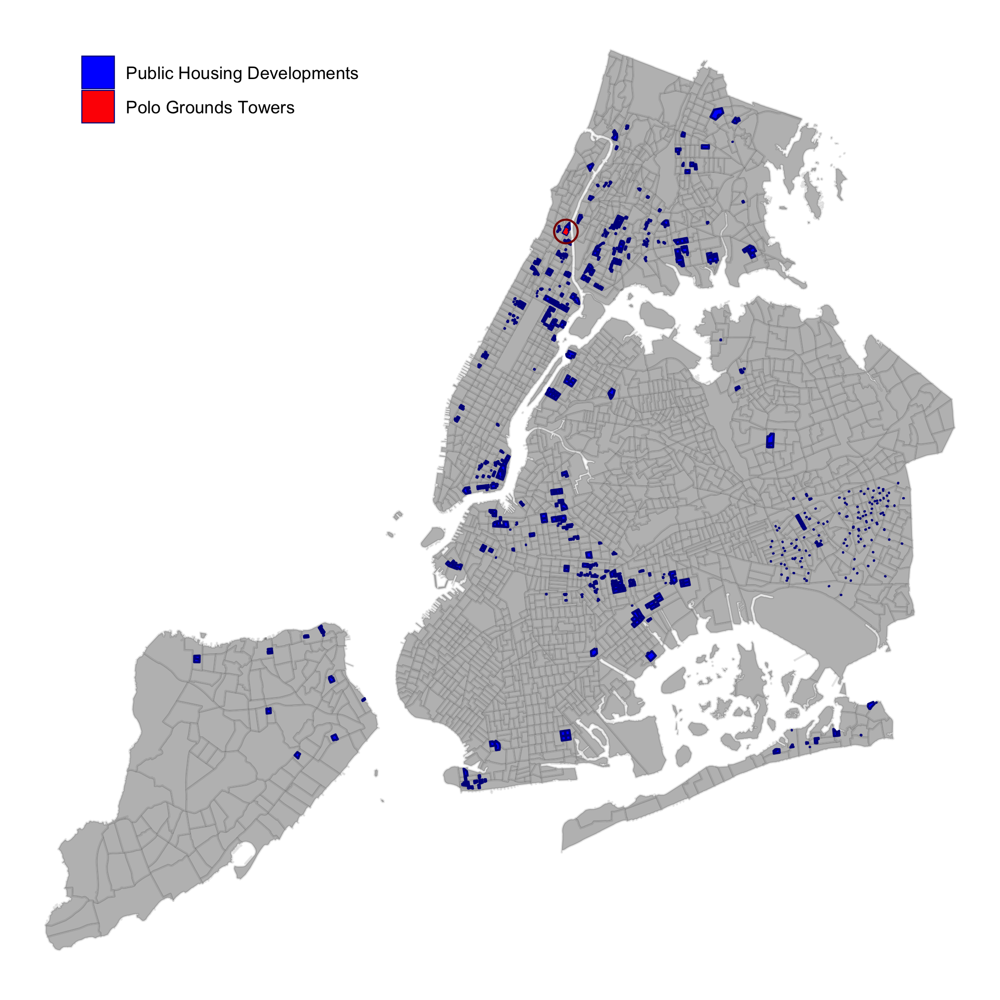
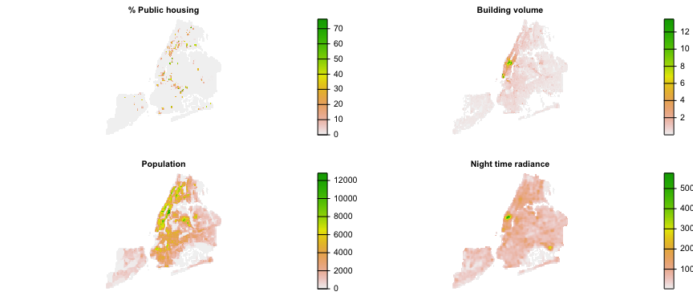
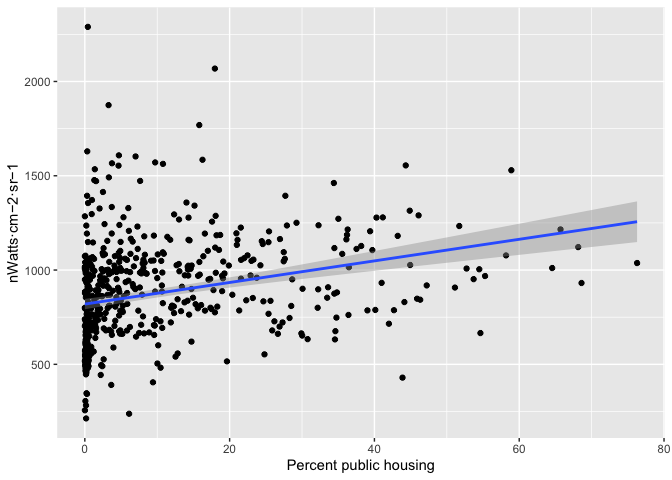
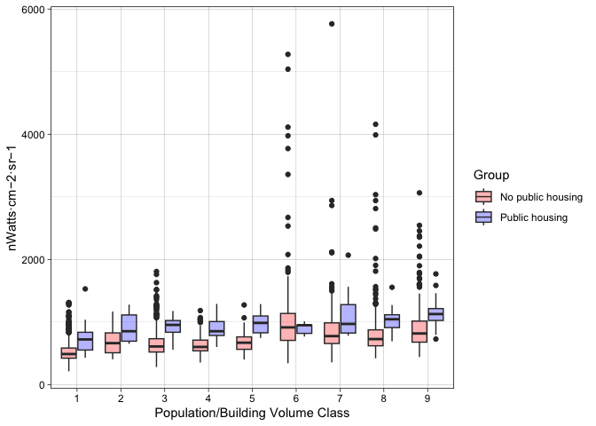

Are Neighborhoods with Public Housing Projects Brighter?
================

Following on from the previous exercise, we look at New York’s public
housing on a larger scale, looking at brightness values in parts of the
city where public housing exists, and compare it to brightness in
similar areas without public housing.

## Datasets

We need the following data for this exercise:

- The monthly average night lights between 2012-2021, averaged for each
  of the 12 months and across all months in the time series.
- The NYC public housing building footprints
- Gridded population data for NYC for 2020
- Gridded coverage of public housing
- Gridded data describing the volume of buildings in NYC

``` r
sysfiles <- function(x) {
  system.file(paste0("extdata/", x), package = "USFlite")
}
  
# NYC census tracts
nycpop <- rast(sysfiles("nyc_pop.tif"))

# NYC public housing development
nycha <- readRDS(sysfiles("nycha.RDS")) 
nyc <- readRDS(sysfiles("nyc.rds"))
nyc_phfrac <- rast(sysfiles("nyc_ph_coverage.tif"))

# Nightlights data
nlight_lt <- rast(sysfiles("nightlights_mean.tif"))

# NYC building dimensions
buildings <- rast(sysfiles("nyc_building_dims.tif"))
```

## Public housing in New York

Another look again at the map from the previous example, showing where
NYC’s public housing is found.  


We are going to use a version of the public housing dataset that is
gridded to match the resolution of the nightlights data. We will combine
that with US Census population data gridded to match the same
resolution, as well as an estimate of the total building volume in each
grid cell (derived from NY’s building footprint data), which measures
how much potential living space there is and the structure of the built
environment.

``` r
rs <- c(nyc_phfrac * 100, buildings$vol, nycpop, mask(nlight_lt, nycpop))
names(rs) <- c("ph", "volume", "population", 
               "radiance")
plot(rs, nc = 2, axes = FALSE,
     main = c("% Public housing", "Building volume", "Population", 
              "Night time radiance"))
```

<!-- -->

We will use these data to identify similar areas in terms of building
structure and populations with and without public housing.

### Does brightness increase with increasing levels of public housing?

We can start by taking a first look at the data to see whether areas
with public housing are brighter or not, using a simple regression in
which we compare the change in night time radiance under increasing
percentages of public housing in each nightlights pixel.

``` r
dat <- as_tibble(as.data.frame(rs, cells = TRUE)) %>% na.omit(.)
dat %>% filter(ph > 0) %>% 
  ggplot() + geom_point(aes(x = ph, y = radiance)) + 
  geom_smooth(aes(x = ph, y = radiance), method = "lm") + 
  xlab("Percent public housing") + ylab("nWatts·cm−2·sr−1")
```

<!-- -->

That plot shows a lot of variability, but a noticeable increase in
brightness as the coverage of public housing increases.

### Comparing areas with similar population and urban structure

The regression above leaves out a lot of information about the
characteristics of city that might tell us whether areas with public
housing are more brightly lit than areas without public housing. To get
a better sense of that, we want to compare pixels containing public
housing to those without while controlling for their levels of
population and building volumes, so that we are comparing areas that are
otherwise similar in their characteristics.

To do that, we have to process the data a bit more first, by:

1.  Identifying different groupings of population and building volume in
    areas with \>10% of their areas occupied by public housing

2.  Grouping pixels with and without public housing in them according to
    levels defined by differing percentiles of building volume and
    population

``` r
# Quantiles of population and building volume
pop_quantiles <- dat %>% filter(ph > 10) %>% 
  pull(population) %>% quantile(.)
vol_quantiles <- dat %>% pull(volume) %>% quantile(.)

popvol <- dat %>% filter(ph > 10) %>% 
  mutate(., pop_class = cut(population, pop_quantiles, dig.lab = 4)) %>% 
  mutate(., bvol_class = cut(volume, vol_quantiles, dig.lab = 2))

# create a cross tabulation of building volumes and population to define 
# joint levels of building volume and population
ctab <- table(pop = popvol$pop_class, bvol = popvol$bvol_class)
ctab <- as.data.frame(ctab) %>% 
  separate(., col = pop, into = c("pop_l", "pop_u"), sep = ",") %>% 
  separate(., col = bvol, into = c("bvol_l", "bvol_u"), sep = ",") %>% 
  mutate(., pop_l = as.numeric(gsub("\\(", "", pop_l))) %>% 
  mutate(., pop_u = as.numeric(gsub("\\]", "", pop_u))) %>%
  mutate(., bvol_l = as.numeric(gsub("\\(", "", bvol_l))) %>% 
  mutate(., bvol_u = as.numeric(gsub("\\]", "", bvol_u))) %>% 
  filter(., Freq > 1)

# Select pixels with no public housing within the different categories
# of population and building volume
no_ph_dat <- lapply(1:nrow(ctab), function(x) {   # x <- 1
  l <- ctab[x, ]
  dat %>% filter(ph == 0) %>% 
    filter(between(population, l$pop_l, l$pop_u)) %>% 
    filter(between(volume, l$bvol_l, l$bvol_u)) %>% 
    mutate(Level = factor(x), Group = "No public housing")
}) %>% bind_rows()

# group the cells containing public housing into the same categories 
ph_dat <- lapply(1:nrow(ctab), function(x) {   # x <- 1
  l <- ctab[x, ]
  dat %>% filter(ph > 10) %>% 
    filter(between(population, l$pop_l, l$pop_u)) %>% 
    filter(between(volume, l$bvol_l, l$bvol_u)) %>% 
    mutate(Level = factor(x), Group = "Public housing")
  
}) %>% bind_rows()

# combine into single table 
combined <- bind_rows(ph_dat, no_ph_dat)
```

Having prepared the data, we can now look at the differences using box
plots to compare the differences between pixels with public housing to
those that don’t, grouped according to the population and building
volume levels

``` r
p <- ggplot(combined) + 
  geom_boxplot(aes(x = Level, y = radiance, fill = Group)) +
  scale_color_manual(values = c('red', 'blue')) +
  scale_fill_manual(values = alpha(c('red', 'blue'), 0.3)) +
  xlab("Population/Building Volume Class") + ylab("nWatts·cm−2·sr−1") +
  theme_linedraw() #+
p
```

<!-- -->

That shows that for almost every level, pixels containing public housing
are more brightly lit then those that have no public housing. Let’s
calculate the averages:

``` r
rad_stats <- combined %>%
  group_by(Group, Level) %>% 
  summarize(Radiance = median(radiance)) %>% ungroup() %>% 
  pivot_wider(names_from = Group, values_from = Radiance) %>% 
  mutate(Difference = `Public housing` - `No public housing`)

knitr::kable(rad_stats, digits = 0)
```

| Level | No public housing | Public housing | Difference |
|:------|------------------:|---------------:|-----------:|
| 1     |               489 |            722 |        233 |
| 2     |               663 |            853 |        190 |
| 3     |               610 |            954 |        344 |
| 4     |               602 |            853 |        251 |
| 5     |               670 |            986 |        316 |
| 6     |               915 |            950 |         35 |
| 7     |               775 |            970 |        194 |
| 8     |               728 |           1045 |        317 |
| 9     |               817 |           1128 |        310 |

That compares the median difference between the two groups at each
level, which shows fairly sizable brightness differences in each
category. We will discuss what that potentially means in terms of
surveillance levels.
